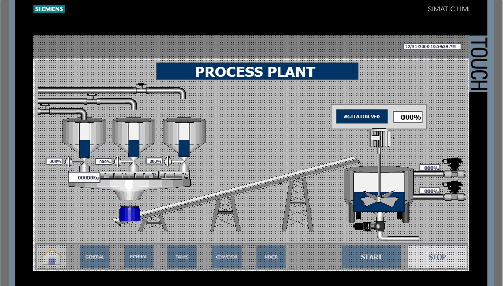

# PLC_Tia_Portal_Energy_Drink
Program designed to control an energy drink plant with **modular programming** in **Awl**, **Scl** and **Fbd**.
## Project Description
This project has been created to simulate the production plant of an energy drink. It is an ongoing project which needs some modifications and implementations to make it more efficient, roboust and error proof.

The process consist of **three main tanks**, containing water, flavours and other conservants. Every individual tank has been implemented with a common "**FC_Tank_Level**" with a **filling** (open-close) **valve** and **discharge** (proportional) **valve** , which are in charge of filling and emptying the tanks independently of each other, depending on the level of the tank and the system`s demands.

A **conveyor belt** to transport the ingredients to a **mixer tank**, in which, the ingredients will be blended with sirupes and caffeine controlled by their own proportional valves and a **frecuency driver**.

## Project operation walk through
The recipe contains all the necessary infomation to make the production of a specific batch. Once a recipe has been placed on the **HMI panel** and the operator validates it by pressing the "Start" button, the process can begin. In case of any mistakes when entering the recipe data, the operator can press the "Reset" button to clear the previous action and enter the new valid data.
### Tanks level management
if the tanks are empty, they will start filling to their **pre-configure setpoints** (which could be different). Once the low level has been reached, the tanks are operationally ready and the production of the batch can begin. In the meantime, the tanks will keep their valves opened until the maximum level is triggered.

**Discharge valves** are commanded by the **demands** of the system at that point in time and the **level** of every tank. If the level is **too low** the proportional valve will close. On the other hand, if the level is **whithin parameters**, the valve will open proportionally to the actual demand.

### Product weighing management
As the product is extracted from the tanks, it is being weighed by an industrial scale. When the scale sensor starts measuring each product separately and the measure increases, each proportional valve closes following an **"inverse proportional mode"**. Once all the products have been measured and all the valves are closed, the scale discharge valve will open letting the fluid pass and start filling the container. At the same time, a command will be sent to the "conveyor station" to start operating the motor using a **Star-Delta Starter**.
### Conveyor belt manangement
The conveyor belt will be active from the first time it recives the activation command until the mixer tank is filled with all the product. If at any point of the process the motor **overload is triggered** or any **safety measures** need to be put in place, the conveyor belt will be automatically stopped. 

### Mixer tank management
This station is the last. When all the product has been brought from the tank through the conveyor belt and the mixer tank low level limit sensor has been reached. The sensor **sends a command** to the motor through the **frequency driver** to start blending the products. At the same time, a command is sent to the **caffeine and sirupe proportional valves** to start inyecting product to the mixer tank following the recipe specifications.

Once the specific blending time has passed, the proportional valves will close and the discharge valve of the mixer tank will open. The mixer will remain active (mixing product) until the level of the tank is equal or below the low limit. At that time, a command will be sent to the frequency driver to stop it. When all the product has left the tank the discharge valve will close and the plant will be ready for another batch of the same recipe or a cleaning process before another recipe is uploaded.
